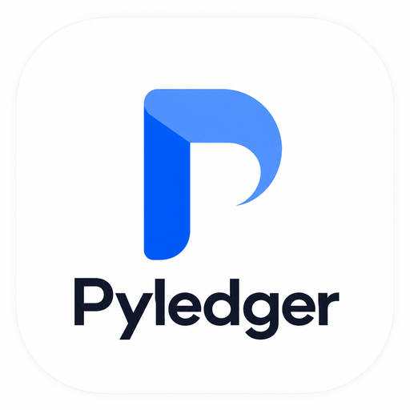

<p align="center">
  
</p>

<h1 align="center">PyLedger</h1>

**Learn Python, line by line — in the browser, with no install and no server.**

PyLedger is a self-paced Python course that runs a real CPython interpreter inside your browser tab. Read a lesson, type an answer in the editor, run it, and get checked against real test code. Nothing is simulated and nothing is sent anywhere — your progress stays on your own device.

🔗 **[Open PyLedger](https://akrionyx.github.io/PyLedger/)**

---

## What's inside

18 modules, 34 lessons, from `print()` to decorators, generators, async and dataclasses.

| | |
|---|---|
| Getting started | printing, comments, reading tracebacks |
| Core Python | variables, types, operators, strings, control flow, loops |
| Structures | lists, dictionaries, tuples, sets, comprehensions |
| Functions & modules | arguments, scope, `*args`, the standard library |
| Files & errors | reading and writing, `try`/`except`, raising |
| Objects | classes, inheritance, dunder methods, properties |
| Advanced | iterators, generators, decorators, context managers, `map`/`filter`/`lambda` |
| Practice | testing, async, type hints, PEP 8, capstone projects |

## Features

- **Real Python, in the tab.** CPython compiled to WebAssembly via [Pyodide](https://pyodide.org). No account, no cloud runner, no rate limit.
- **Write and run.** A CodeMirror editor with Python syntax highlighting, a Run button, and live output.
- **Answers are checked, not guessed.** Each exercise ships with test code that runs against what you wrote.
- **Stop button.** An accidental `while True:` gets killed without taking the page down with it.
- **Your work is kept.** Code you type and lessons you finish are saved per lesson and restored when you come back.
- **Hints and solutions.** A hint whenever you want one; the worked solution unlocks after three failed attempts.
- **Quizzes and checkpoints.** Short questions between lessons, a checkpoint that replays everything so far, and a "practice your mistakes" mode that only shows the ones you got wrong.
- **Search and time estimates.** Find any lesson by keyword; every lesson shows roughly how long it takes.
- **Export and import.** Progress lives in your browser, so there's a one-click backup file you can move to another device.
- **Works on a phone.** Collapsible lesson list and a symbol row above the editor for the keys Python needs that phone keyboards hide.

## Keyboard shortcuts

| Shortcut | Action |
|---|---|
| `Ctrl` / `Cmd` + `Enter` | Run code |
| `Ctrl` / `Cmd` + `Shift` + `Enter` | Check my answer |
| `Esc` | Close the review panel or the lesson list |

## Running it locally

There's no build step and no dependencies to install. It does need to be served over HTTP rather than opened as a file, because the Python engine runs in a web worker.

```bash
git clone https://github.com/Akrionyx/PyLedger.git
cd PyLedger
python3 -m http.server 8000
```

Then open <http://localhost:8000>.

## Deploying

Any static host works. For GitHub Pages: push to `main`, then **Settings → Pages → Source: Deploy from a branch → main / (root)**.

## How it's built

| File | What it does |
|---|---|
| `index.html` | Page shell and CDN script tags |
| `style.css` | All styling. Design concept: an accountant's ledger meets a code terminal — ink-navy workspace, ledger-green paper for reading, a sunken terminal panel for code |
| `course-data.js` | Every lesson, as plain data |
| `app.js` | The engine: lesson rendering, progress, the Python worker, quizzes, review |

No framework, no bundler, no backend. The only external dependencies are Pyodide and CodeMirror, both loaded from a CDN.

Python runs in a **web worker**, separate from the page, so a slow or runaway program can be stopped without freezing the interface. Every run gets a fresh namespace, so a variable defined in one lesson can never make a later answer pass by accident.

## Adding a lesson

Lessons are plain objects in `course-data.js`. Add one to a module's `lessons` array:

```js
{
  id: 'loops-3',                       // must be unique across the whole course
  title: 'Nested loops',
  body: `<p>HTML for the lesson text. <code>Inline code</code> works.</p>`,
  example: `for i in range(3):\n    print(i)`,   // optional, read-only
  exercise: {                                    // optional
    prompt: `What the learner has to do. HTML allowed.`,
    starterCode: `# your code here\n`,
    testCode: `assert total == 9, "total should be 9"`,
    successMessage: `Nice — nested loops done.`,
    hint: `Remember the inner loop runs fully for each outer step.`,  // optional
    solution: `total = sum(i * j for i in range(3) for j in range(3))` // optional
  },
  quiz: {                                        // optional
    question: `What does <code>range(3)</code> produce?`,
    options: [`0, 1, 2`, `1, 2, 3`, `0, 1, 2, 3`],
    correctIndex: 0,
    explanation: `range stops before the number you give it.`
  }
}
```

Notes:

- `testCode` runs in the same namespace as the learner's code, so it can see their variables and functions.
- To check printed output instead of a variable, use `__pyledger_stdout__`, which holds everything the code printed:
  ```js
  testCode: `assert "Hello" in __pyledger_stdout__, "Print the word Hello"`
  ```
- A lesson with no exercise and no quiz gets a "Mark as read" button instead.

## Your data

Everything stays in your browser's local storage: which lessons you've finished, and the code you typed. There is no account, no analytics and no server. Clearing your browser data clears your progress, which is what **Export progress** is for.

## Known limitation

The threading lesson in Module 16 may not run, because browser Python generally can't start real OS threads. The concepts and the async lesson beside it work fine.

## Browser support

Any current version of Chrome, Edge, Firefox or Safari, on desktop or mobile. The first run downloads the Python engine (a few seconds, once); after that it's cached.

## Credits

Built with [Pyodide](https://pyodide.org) and [CodeMirror](https://codemirror.net). Typefaces: Fraunces and IBM Plex.

## Licence

MIT.
